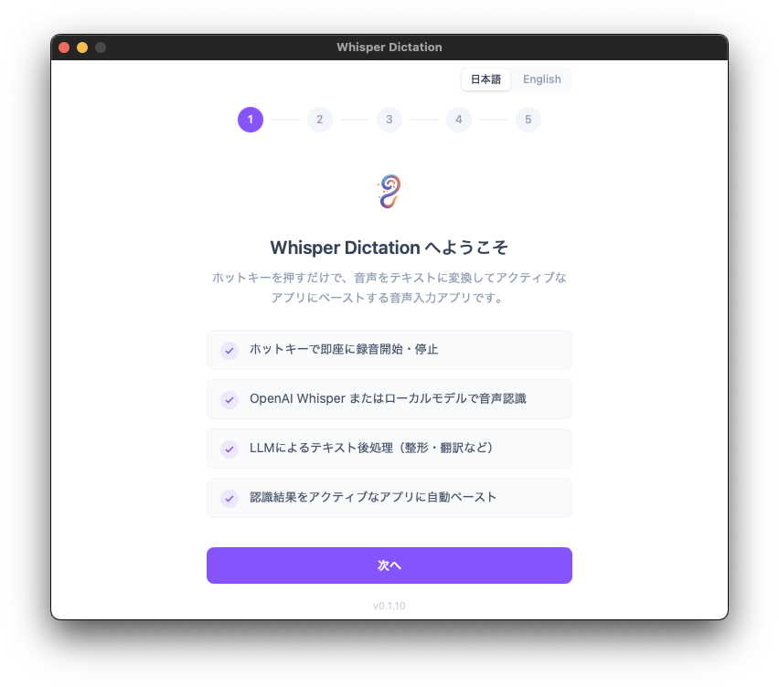
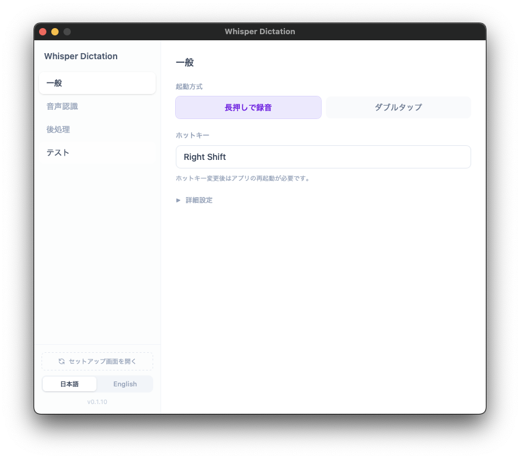
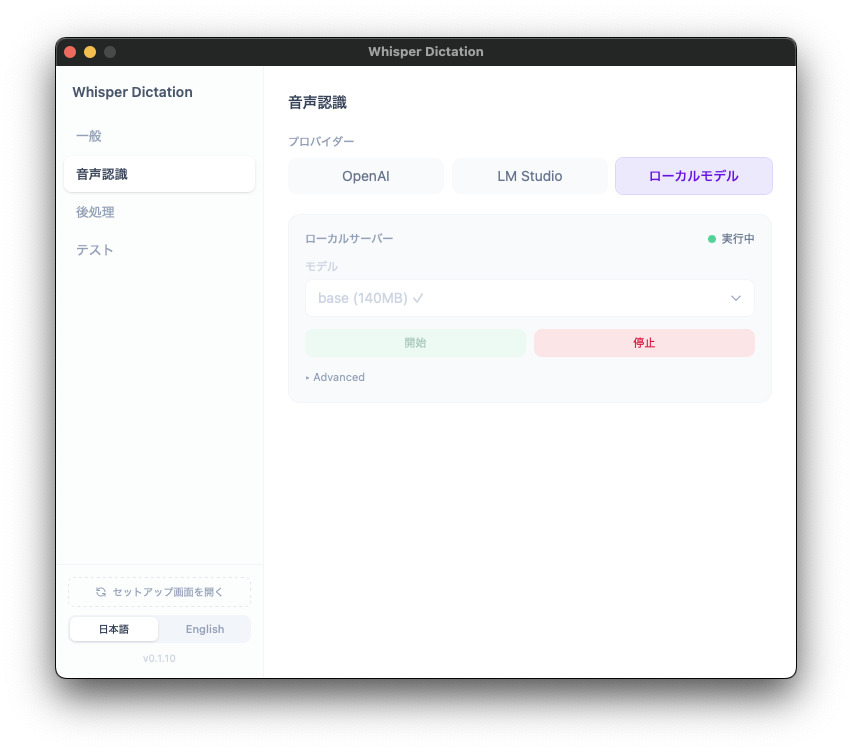
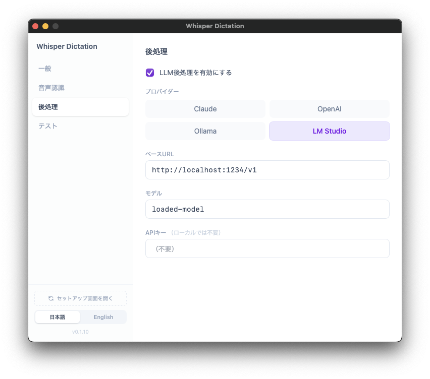
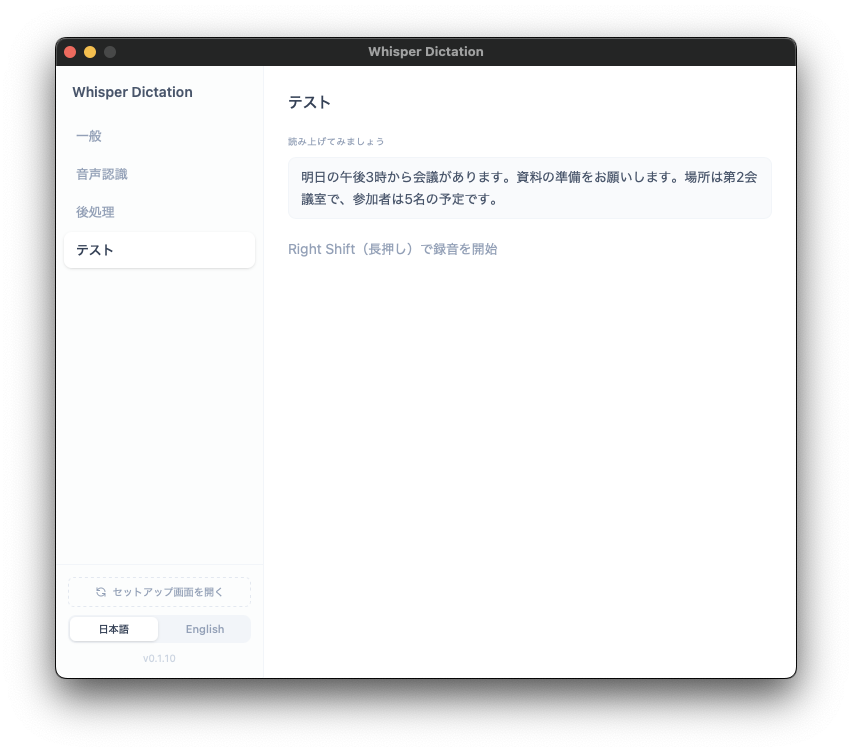

**English** | [日本語](README_JA.md)

# Whisper Dictation

A speech-to-text desktop app for macOS built with Tauri. Set up OpenAI, LM Studio, or faster-whisper-server to use your preferred STT engine.

## Screenshots

| Onboarding | General Settings | STT Engine |
|:---:|:---:|:---:|
|  |  |  |

| Post-processing | Test |
|:---:|:---:|
|  |  |

## Features

- **Any key as your record button** — Assign any key (or combination) as your recording hotkey
- **Multiple STT backends** — OpenAI Whisper API / local faster-whisper / LM Studio
- **LLM post-processing (optional)** — Use cloud AI services or a local LLM for text cleanup
- **Fully local operation** — Runs entirely on-device with faster-whisper, no cloud needed
- **Hallucination reduction** — Mitigates common faster-whisper hallucinations caused by noise (e.g. "Thank you for watching")

## Known Limitations

### Speech Recognition
- OpenAI / LM Studio STT backends have not been fully tested

### Post-processing
- Claude / Ollama / OpenAI post-processing has not been fully tested

*Only the combination of faster-whisper-server (STT) + LM Studio (post-processing) has been verified.*

## Requirements

- macOS 12.0+
- [Node.js](https://nodejs.org/) 18+
- [Rust](https://www.rust-lang.org/tools/install) (stable)
- Python 3.9+ (only for local Whisper)

## Installation

### Pre-built App

Download from the [Releases](../../releases) page (unsigned).

### Build from Source

```bash
git clone https://github.com/naotochan/whisper-dictation.git
cd whisper-dictation
npm install
npx tauri build --bundles app
```

Output: `src-tauri/target/release/bundle/macos/Whisper Dictation.app`

## Setup

1. Launch the app to start the onboarding flow
2. Grant macOS permissions (Accessibility / Input Monitoring / Microphone). After granting Input Monitoring, an app restart is required
3. Choose your STT engine (OpenAI API / LM Studio / Local model via faster-whisper-server)
4. Configure your hotkey
5. Test recording to verify

### Local Model (No Cloud)

Select "Local Model" in settings and run the one-click setup. It automatically creates a Python venv, installs faster-whisper, and downloads the model.

## Usage

1. Open settings from the menu bar tray icon
2. Press your hotkey and speak — recognition starts when you release. By default, it records while held
3. The result is automatically pasted into the active window

## Tech Stack

| Layer | Technology |
|-------|-----------|
| Framework | [Tauri v2](https://v2.tauri.app/) (Rust + WebView) |
| Frontend | React + TypeScript + Tailwind CSS |
| Audio | [cpal](https://github.com/RustAudio/cpal) |
| STT | OpenAI Whisper API / [faster-whisper](https://github.com/SYSTRAN/faster-whisper) |
| LLM | Claude API / OpenAI API / Ollama / LM Studio |
| Paste | [enigo](https://github.com/enigo-rs/enigo) (Cmd+V simulation) |
| Hotkey | tauri-plugin-global-shortcut + macOS CGEventTap |

## License

MIT

## Acknowledgements

- [Tauri](https://tauri.app/) — Rust-based desktop app framework
- [faster-whisper](https://github.com/SYSTRAN/faster-whisper) — Fast Whisper implementation using CTranslate2
